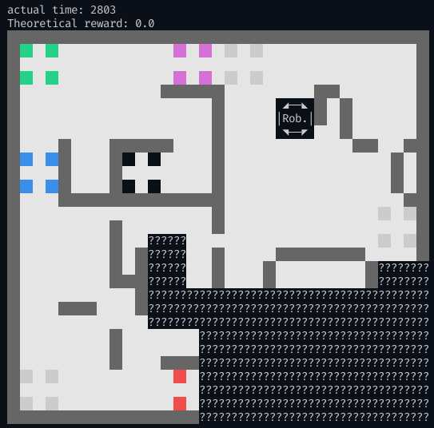
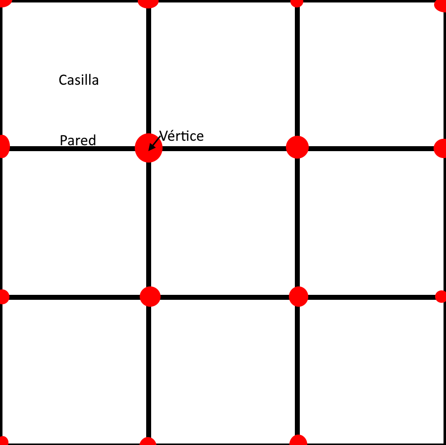
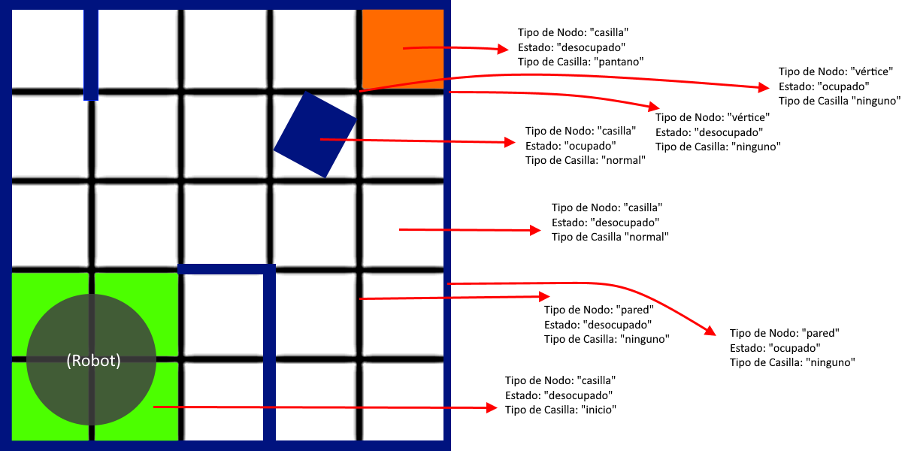

<div align="center">
<h1>Machine Learning aplicado a resolución de laberintos en robótica simulada<h1/>


</div>

<br>

Estamos participando en la competencia de rescate simulado de la RoboCup, utilizando el simulador de  Webots . En esta categoría el robot debe recorrer un laberinto, buscando víctimas y reportando su posición. A raíz de esta consigna, surge el problema de cómo recorrerlo en el menor tiempo posible, para el cual pensamos en aplicar machine learning.

Video de ejemplo de una ronda de la competencia, utilizando el simulador:
https://www.youtube.com/watch?v=C_sho03AJmo

## Problema:

**Dado un laberinto el robot debe recorrerlo en su *totalidad*, de la manera mas eficiente posible, solo conociendo las partes que ya exploró, descubriendolo gradualmente.**
   
## Avances
   
Contamos con una **version simplificada** del problema en python para evitar utilizar el simulador de webots para entrenar modelos y realizar pruevas, **pero es nuestro objetivo final trasladarlo a ese simulador.**
   
Nuestra versión simplificada en un mundo de ejemplo:
<div align="center">

</div>

Si querés ver como es el simulador, acá hay un link a la documentación de la competencia: https://erebus.rcj.cloud/docs/

Para la competencia contamos con un customizador de mapas que proveen los organizadores, es decir una manera de crear laberintos. Contamos con un parser para transformar el json que nos devuelve a nuestra versión simplificada.

Creador de laberintos: https://osaka.rcj.cloud/service/editor/simulation/2021

Implementamos un environment de openAI gym y lo intergamos con la versión simplificada.

Implementamos un generador de mapas aleatorio.

Realizamos algunos experimentos simples con machine learning para el problema de cart-pole balancing utilizando AI gym y Stable Baselines 3:

https://github.com/CoolRobotsAndStuff/ai_pendulum_balancing_robot

## El laberinto

Esta es una explicación de nuestro entorno a alto nivel.

Para representar el laberinto utilizamos una serie de nodos organizados en una array bidimensional. Cada nodo puede representar una casilla, una pared o un vértice, como se muestra a continuación:

*Dada una grilla:*

<div align="center">

</div>

Lo representamos de la siguiente manera, donde:

V = nodo de vertice

P = nodo de pared

C = nodo de casilla

```
[[V, P, V, P, V],                
 [P, C, P, C, P],                 
 [V, P, V, P, V],                  
 [P, C, P, C, P],                 
 [V, P, V, P, V]]

```         
   
### El Nodo

Cada **Nodo** posee los sigueintes datos:

* Tipo de nodo, puede ser:
    * *casilla*
    * *vértice*
    * *pared*

* Estado, puede ser:
    * *ocupado*
    * *no ocupado*
    * *desconocido*

* Tipo de casilla (solo para nodos con tipo de nodo "casilla"), puede ser:
    * *desconocido*
    * *normal*
    * *casilla de inicio*
    * *conexión de zona 1 a 2*
    * *conexión de zona 1 a 3*
    * *conexión de zona 3 a 2*
    * *pantano*
    * *pozo*
    * *checkpoint*

    **Todas ellas tienen distintas propiedades en la simulación.**

### Ejemplo



### Environment de AI gym

Nuestro espacio de observación es la grilla en sí. La estamos encodeando con one-hot encoding. 

Nuestro espacio de acción es discreto con cuatro movimientos: "up", "down", "left", "right"

Si trata de moverse a una posición inválida le damos un reward de -10. Si termina la partida le damos un rewar proporcional a la cantidad de casillas del laberinto. En el resto de los casos le damos un reward de -1 para incentivar qque reccora el laberinto en el menor tiempo posible.
   
## Dudas y Preguntas
   * **¿Qué librerias nos recomendarias para este tipo de problema?** 

## Como reproducir pruebas y entorno

   Instalar python 3.8.10 y pip:

   Windows:

   https://www.python.org/downloads/release/python-3810/

   Ubuntu:

   ```
   sudo apt update
   ```
   ```
   sudo apt install build-essential zlib1g-dev libncurses5-dev libgdbm-dev libnss3-dev libssl-dev libreadline-dev libffi-dev libsqlite3-dev wget libbz2-dev
   ```
   ```
   cd /opt
   ```
   ```
   sudo wget https://www.python.org/ftp/python/3.8.10/Python-3.8.10.tgz
   ```
   ```
   sudo tar -xf Python-3.8.10.tgz
   ```
   ```
   cd Python-3.8.10
   ```
   ```
   sudo ./configure --enable-optimizations
   ```
   ```
   sudo make install
   ```

   Clonar repositorio

   ```
   git clone https://github.com/CoolRobotsAndStuff/machine-learning-for-maze-exploration.git
   ```
   Instalar dependencias

   ```

   python3.8 -m pip install numpy gym tensorflow keras mlflow bresenham google-cloud-storage


   ```
   Instalar fremwork de rl para keras integrado con mlflow
   ```
   git clone https://github.com/CoolRobotsAndStuff/keras-rl2-mlflow.git
   ```
   ```
   cd keras-rl2-mlflow
   ```
   ```
   pip install .
   ```


   Para correr la versíon simplificada manualmente:
   ```
   python3.8 maze_explorer/game.py
   ```
   Para correr el environment de gym con un agente aleatorio:
   ```
   python3.8 maze_explorer/environment.py
   ```
   Para correr un test de entrenamiento:
   ```
   python3 maze_explorer/training_test1.py
   ```


## Extras

El código que hicimos para la competencia pasada: https://github.com/iita-robotica/rescate_laberinto/tree/ale/roboliga_2021/Competencias/Roboliga_2021/FinalCode
   
## Recursos Utiles (para nosotros)
   
   Curso introductorio a TensorFlow:
   
   https://www.youtube.com/watch?v=tPYj3fFJGjk&t=6898s&ab_channel=freeCodeCamp.org

