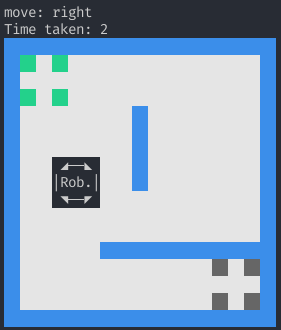

<div align="center">
<h1>Machine Learning aplicado a resolución de laberintos en robótica simulada<h1/>


</div>

<br>

Estamos participando en la competencia de rescate simulado de la RoboCup, utilizando el simulador de  Webots . En esta categoría el robot debe recorrer un laberinto, buscando víctimas y reportando su posición. A raíz de esta consigna, surge el problema de cómo recorrerlo en el menor tiempo posible, para el cual pensamos en aplicar machine learning.

## Problema:

**Dado un laberinto el robot debe recorrerlo en su *totalidad*, de la manera mas eficiente posible, solo conociendo las partes que ya exploró, descubriendolo gradualmente.**

Video de ejemplo de una ronda de la competencia, utilizando el simulador:
https://www.youtube.com/watch?v=C_sho03AJmo

   
## Avances
   
Contamos con una **version simplificada** del problema en python para evitar utilizar el simulador de webots para entrenar modelos y realizar pruevas, **pero es nuestro objetivo final trasladarlo a ese simulador.**
   
Nuestra versión simplificada en un mundo de ejemplo:
<div align="center">

</div>

Si querés ver como es el simulador, acá hay un link a la documentación de la competencia: https://erebus.rcj.cloud/docs/

Realizamos algunos experimentos simples con machine learning para el problema de cart-pole balancing utilizando AI gym y Stable Baselines 3:

https://github.com/CoolRobotsAndStuff/ai_pendulum_balancing_robot

Pero estamos desorientados en como atacar este problema en específico. Hay mas detalles sobre nuestras dudas en la sección de preguntas.

## El laberinto

Esta es una explicación de nuestro entorno a alto nivel.

Para representar el laberinto utilizamos una serie de nodos organizados en una array bidimensional. Cada nodo puede representar una casilla, una pared o un vértice, como se muestra a continuación:

*Dada una grilla:*

<div align="center">

</div>

Lo representamos de la siguiente manera, donde:

V = nodo de vertice

P = nodo de pared

C = nodo de casilla

```
[[V, P, V, P, V],                
 [P, C, P, C, P],                 
 [V, P, V, P, V],                  
 [P, C, P, C, P],                 
 [V, P, V, P, V]]

```         
   
### El Nodo

Cada **Nodo** posee los sigueintes datos:

* Tipo de nodo, puede ser:
    * *casilla*
    * *vértice*
    * *pared*

* Estado, puede ser:
    * *ocupado*
    * *no ocupado*
    * *desconocido*

* Tipo de casilla (solo para nodos con tipo de nodo "casilla"), puede ser:
    * *desconocido*
    * *normal*
    * *casilla de inicio*
    * *conexión de zona 1 a 2*
    * *conexión de zona 1 a 3*
    * *conexión de zona 3 a 2*
    * *pantano*
    * *pozo*
    * *checkpoint*

    **Todas ellas tienen distintas propiedades en la simulación.**

### Ejemplo


   
## Dudas y Preguntas
   * **¿Qué librerias nos recomendarias para este tipo de problema?** Incursionamos con Stable Baselines 3, pero nuestra investigación nos lleva a pensar que TensorFlow podría ser lo mas apropiado ¿Es así?¿Deberíamos seguir usando AI gym?

   * **¿Qué modelo es conveniente entrenar con respecto a nuestro problema?** Hemos investigado un poco sobre deep Q learning, pero no estamos seguros.
   
   * **¿La estructura de memoria que estamos utilizando es la mejor para este tipo de problema o sería mejor utilizar un grafo, por ejemplo?**

## Como reproducir pruebas y entorno

Instalar python 3.8.10 y pip:

https://www.python.org/downloads/release/python-3810/

Clonar repositorio

```
git clone https://github.com/CoolRobotsAndStuff/machine-learning-for-maze-exploration.git
```

instalar pipenv

```
pip install pipenv
```

crear entorno virutal

```
pipenv shell   python 3.8.10
```

instalar dependencias

```
pipenv install
```

correr entorno
```
#desde la shell del venv
python3 game.py
```

## Extras

El código que hicimos para la competencia pasada: https://github.com/iita-robotica/rescate_laberinto/tree/ale/roboliga_2021/Competencias/Roboliga_2021/FinalCode
   
## Recursos Utiles (para nosotros)
   
   Curso introductorio a TensorFlow:
   
   https://www.youtube.com/watch?v=tPYj3fFJGjk&t=6898s&ab_channel=freeCodeCamp.org

